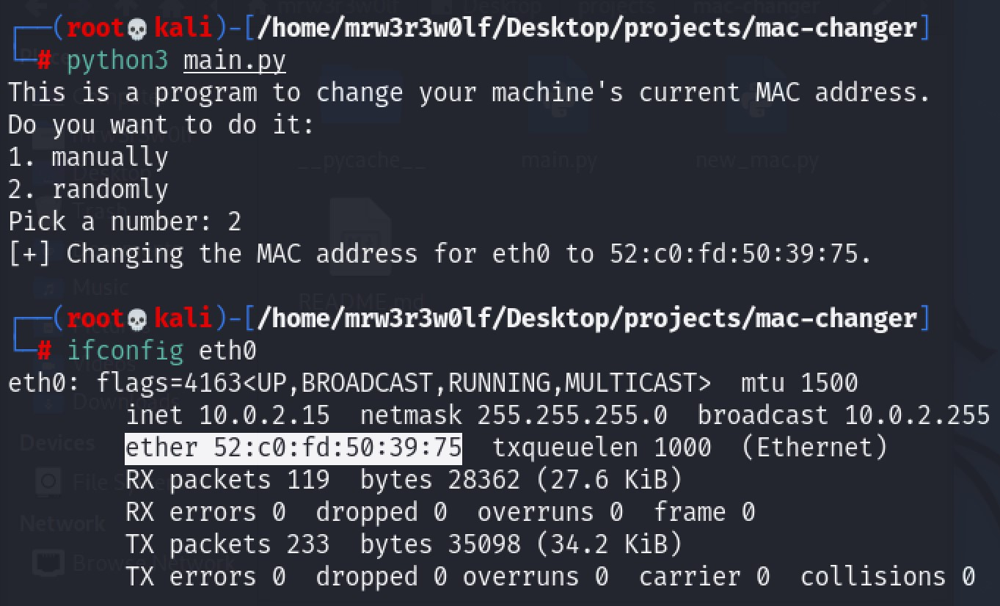

# MAC address changer
**Aim**: Propose A Python program that could either manually or randomly change the machine's current MAC address, depending on user choice.

# Introduction
According to Evans, Martin and Poatsy (2020, _Technology in Action_, 16th edn., p. 480), each network adapter has a physical address, like a serial number on an appliance. This address is called a media access control (MAC) address, and it’s made up of six. two-position characters, such as 01:40:87:44:79:A5. (Don’t confuse this MAC with the Apple computers of the same name.) 

The first three sets of characters (in this case, 01:40:87) specify the manufacturer of the network adapter, and the second set of characters (in this case, 44:79:A5) makes up a unique address.

Because all MAC addresses must be unique, there is an IEEE (Institute of Electrical and Electronics Engineers) committee responsible for allocating blocks of numbers to network adapter manufacturers.

IEEE 802 standards define three commonly used formats to print a MAC address in hexadecimal digits:
- Six groups of two hexadecimal digits separated by hyphens (-), like 01-23-45-67-89-ab
- Six groups of two hexadecimal digits separated by colons (:), like 01:23:45:67:89:ab
- Three groups of four hexadecimal digits separated by dots (.), like 0123.4567.89ab

# Documentation

# Output

